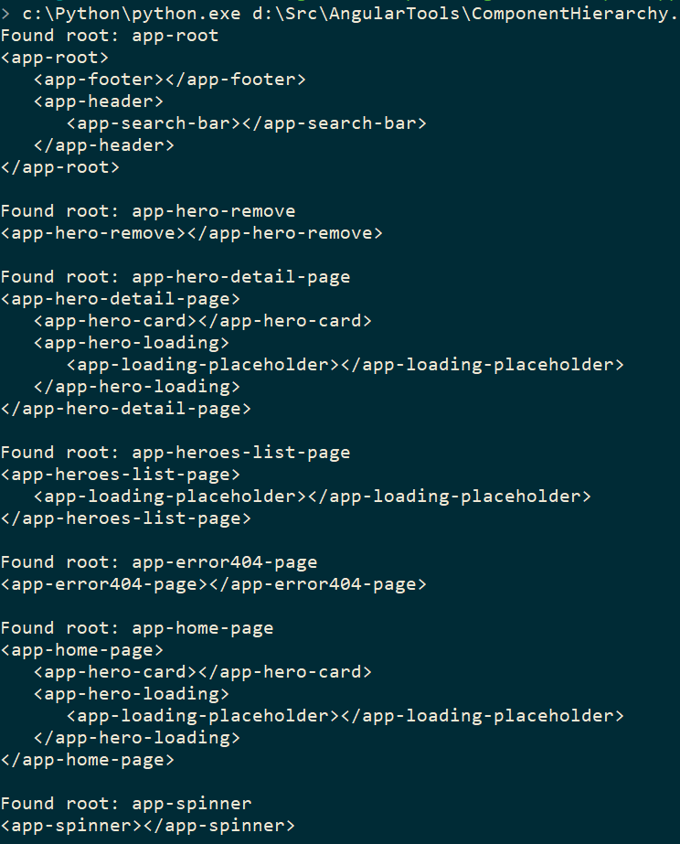
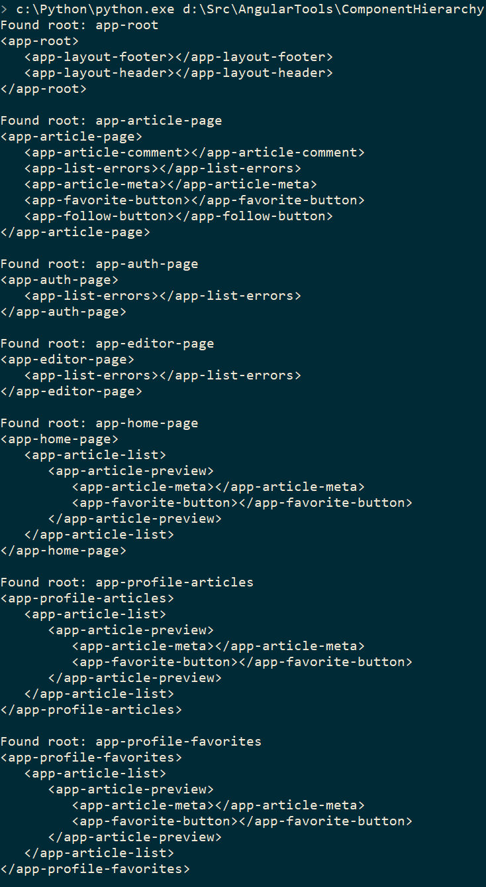
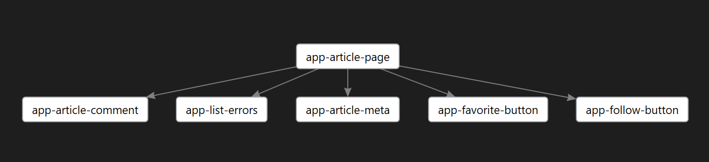
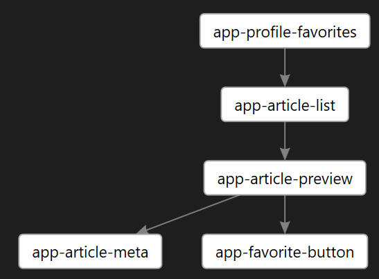
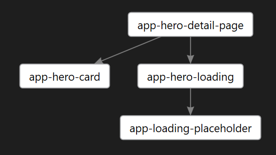
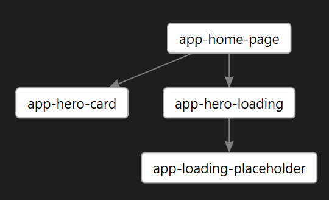
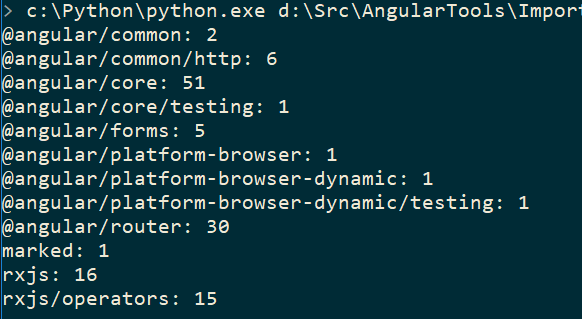
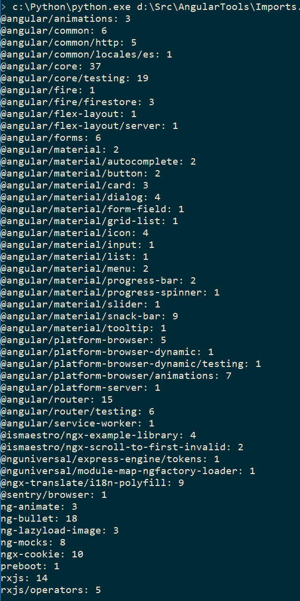
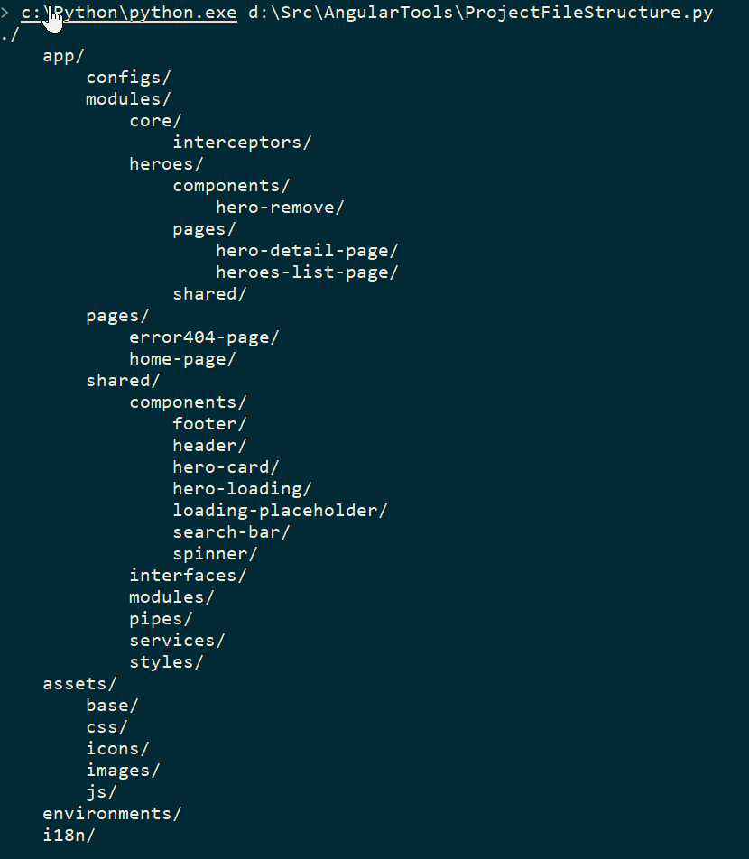
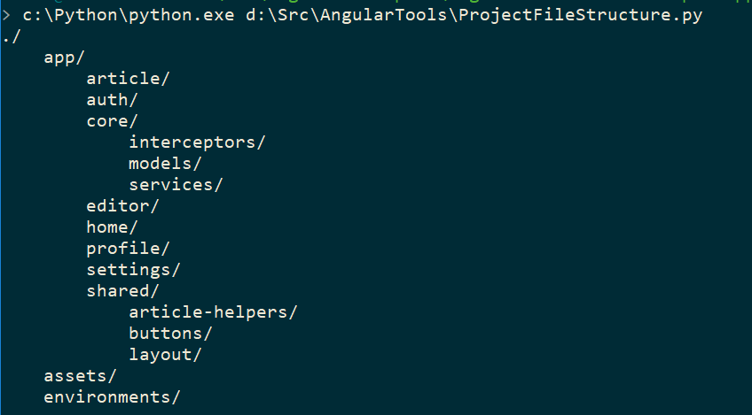

# AngularTools   

This is supposed to be a collection of tools for helping developing Angular projects.

And a collections always starts with a single tool and then it will grow as we find new handy tools.

* `ComponentHierarchy.py` is a tool that scans the Angular applications components and print out the hierarchy of the components. This is a quick way to get an overview of your project.
* `ComponentHierarchyDgml.py` does the same as the `ComponentHierarchy.py` , but it outputs the result into Microsoft Directed Graph (dgml) format.
* `FindUnusedCSSClasses.py` is an attempt on finding css definitions in the css-files that is not used in any templates. But the reality of how complex the difinition and usage of styles is, has made this task much more complicated than i expected. The tool finds many unused styles, but manual checking on some projects of mine have shown that the results should be used carefully.
* `NodeProjectHierarchy.py` is a tool that creates a MarkDown file containing a matrix of what njsproj project files are placed in the folder structure and what TypeScript version they use. It also creates a matrix of what Node packages and the package version each node project uses. The tool scans all njsproj files and all package.json found in the folder structure.
* `Imports.py` is a tool for scanning all Typescript files for the imports and listing how many times each import is used.
* `ProjectFileStructure.py`is a tool for listing all folders in the project directory. You can also specify a command line option to include all filenames in the folders.

## XML Component hierarchy

The examples below are generated by `ComponentHierarchy.py` from these GitHub repositories:

* [https://github.com/Ismaestro/angular8-example-app](https://github.com/Ismaestro/angular8-example-app)
* [https://github.com/gothinkster/angular-realworld-example-app](https://github.com/gothinkster/angular-realworld-example-app)

## Directed Graphs examples

The examples below are generated by `ComponentHierarchyDgml.py` from these GitHub repositories:

* [https://github.com/Ismaestro/angular8-example-app](https://github.com/Ismaestro/angular8-example-app)
* [https://github.com/gothinkster/angular-realworld-example-app](https://github.com/gothinkster/angular-realworld-example-app)

## Imports examples

The examples below are generated by `ComponentHierarchyDgml.py` from these GitHub repositories:

* [https://github.com/Ismaestro/angular8-example-app](https://github.com/Ismaestro/angular8-example-app)
* [https://github.com/gothinkster/angular-realworld-example-app](https://github.com/gothinkster/angular-realworld-example-app)

## Project File Structure examples

* [https://github.com/Ismaestro/angular8-example-app](https://github.com/Ismaestro/angular8-example-app)
* [https://github.com/gothinkster/angular-realworld-example-app](https://github.com/gothinkster/angular-realworld-example-app)

